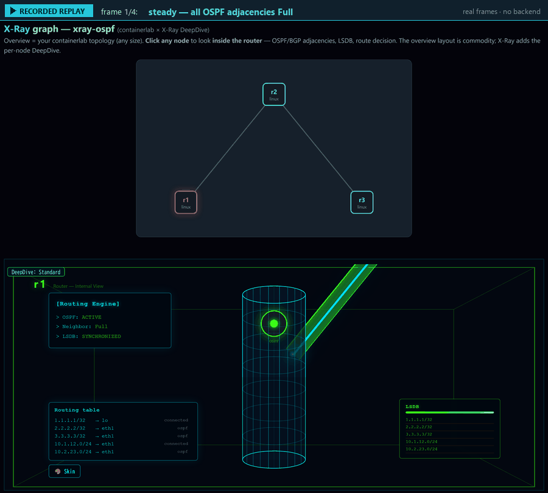
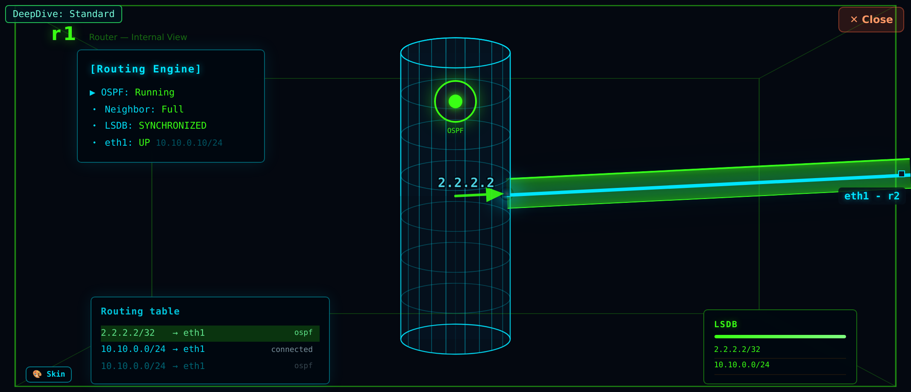
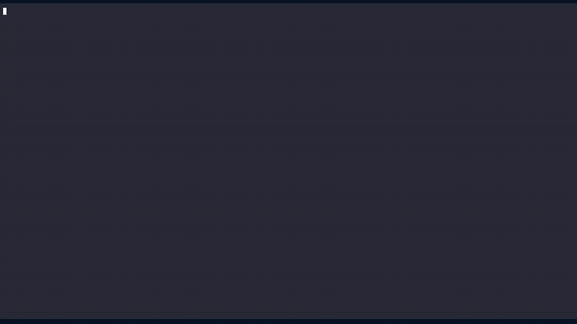
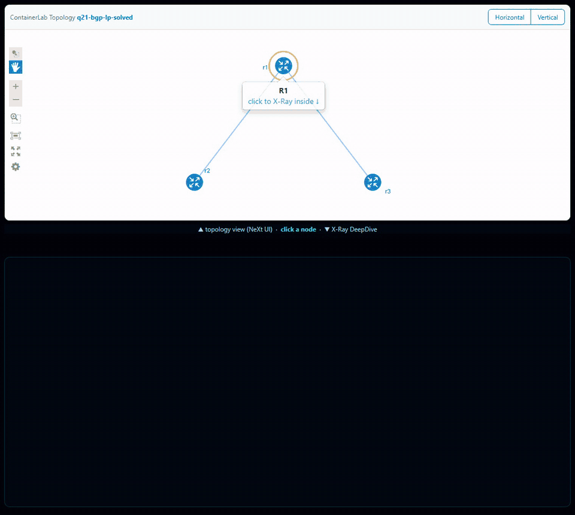

# network-xray

[](https://codespaces.new/rclab-dev/network-xray?quickstart=1)

**Try it in your browser** — the button starts a GitHub Codespace that deploys a 3-router FRR lab with containerlab and opens the X-Ray graph on port 8600 (about 2–3 minutes). Click any router to look inside it; shut an interface (`sudo docker exec clab-q21-bgp-lp-r1 vtysh -c 'conf t' -c 'interface eth2' -c 'shutdown'`) and the picture updates by itself in a few seconds.
- Uses your own Codespaces quota (personal accounts: 120 core-hours/month free; this demo asks for a 4-core machine). **Delete the codespace when you are done.**
- Container-based nodes only (FRR etc.) — Codespaces has no nested virtualization.

**See *why* a router chose its path.** `network-xray` turns a router's live state (`show` / JSON) into a picture of the forwarding decision — which route won, which lost, and why. Zero-install, browser-only.

*English | [日本語](#日本語)*

`network-xray` turns live router & network **state** (OSPF/BGP adjacency, routes, interfaces) into a
picture you can **reason about** — where the packet goes, why the route is (or isn't) there, and how a
failure propagates and recovers. It renders a **topology view** and an **"inside the router"
DeepDive cylinder** (forwarding plane, OSPF/BGP processor, hello & LSDB sync, the route it installs).
You drive it with a few calls through the tidy `xrayCore` facade.

> This is the **same rendering core that powers [RouteCrushLab](https://routecrushlab.com)**,
> not a fork — extracted as a shared module so there is no drift.

It runs **on top of your execution engine** — paste a **containerlab** topology, replay a recorded lab,
or point it at live FRR / SR Linux — the **"why"** layer above the "what".

It is **descriptive**, not a simulator: it draws the real state your feed reports. And it is
**vendor-neutral** — every field it reads is a standard `show`-command concept. FRRouting and
**Nokia SR Linux** are both implemented today (a mixed FRR + SR Linux lab renders uniformly); Cisco
IOS, Arista, … map on via the same small-adapter pattern.

**Status:** network-xray currently supports containerlab with FRR/SR Linux; CML2 and IOS-XE support is in progress.

**Not a config verifier.** network-xray reads **live state** (`show` / JSON = reality) to show *why* a
router decided as it did — it is **not** a config checker. For pre-deployment simulation from config
(intent), use **Batfish**. Different input (state vs config), different question.

**On CLI parsing.** CLI parsing is best-effort and version-fragile; the robust path is **structured
input** (`show … json`, or the collector reading device state directly — the FRR collector already
reads `vtysh … json`). Screen-scraped CLI is a convenience fallback — **PRs with fixtures for more
vendors/versions welcome.**

## Why

I learned to think about networks by drawing them. At an ISP support desk I'd take what a customer
described over the phone — what connects to what — and turn it into a topology diagram I could reason
about and ask others about. Later, while learning routing protocols myself, I drew a different kind of
diagram: what's happening *inside* a router as OSPF/BGP do their thing. Both taught me the same lesson —
a picture in your own head is worthless if the person you're talking to can't see the same one. X-Ray is
those two diagrams turned into a tool: the topology at a glance, and a look *inside* the
router at the forwarding decision (the deepdive).

## See it

**Why one BGP route wins — and it re-decides live.** Two upstreams advertise `8.8.8.0/24` with
different Local Preference. Open r1: the BGP table shows both candidates and a **Best-Path
Decision** panel that explains *why* the winner won (LocPref) — then change the LocPref on the running
lab and the best path flips **in place, no reload** (via r3 at 100 ⇄ via r2 at 150). X-Ray reads the
real FRR state and re-decides — it's *descriptive*, not a simulator. Or open the recorded, no-install
version: [Best-Path Decision demo](https://rclab-dev.github.io/network-xray/demo/index-bgp-lp.html):


**Also an OSPF lab** — OSPF goes Full (green tunnels, full LSDB), a link drops and a router is isolated
(route lost, packet dropped), then it recovers and re-converges:



**Inside the router — the DeepDive cylinder** (an OSPF adjacency at Full: hello, synced LSDB, the route it installs):



**▶ Try it live — no install:** paste a router's `show` output → it draws the topology, then click a
router to look inside. **<https://rclab-dev.github.io/network-xray/>** (or jump straight to
[paste-your-output](https://rclab-dev.github.io/network-xray/frr-paste.html)).

**▶ Or watch a real lab converge & recover** — frames captured from a running FRR/containerlab lab,
replayed in the browser with no backend (steady → link down / router isolated → re-forms → converged):
**[Best-Path Decision](https://rclab-dev.github.io/network-xray/demo/index-bgp-lp.html)** (eBGP: competing LocPref → why one path wins) ·
**[OSPF replay](https://rclab-dev.github.io/network-xray/demo/)** ·
**[BGP replay](https://rclab-dev.github.io/network-xray/demo/index-bgp.html)** (eBGP sessions, AS-paths, BGP table).

<!-- nx_readme_quickstart (2026-10-07) -->
## Quick start: run a lab in containerlab



**You need:** Linux (or Windows with **WSL2**, or a Linux VM) · **Docker** · **[containerlab](https://containerlab.dev/install/)** · **Node.js 18+** · about **2 GB of free memory** (each FRR router is a small container).

```bash
git clone https://github.com/rclab-dev/network-xray.git
cd network-xray
./demo.sh examples/q21-bgp-lp/q21.clab.yml     # deploy -> keep collecting -> serve the graph
```

1. Wait for `==> open http://<this machine>:8080/` (the first run pulls the FRR image — this can take a few minutes).
2. Open **http://localhost:8080/** (from another machine: `http://<host-ip>:8080/`).
3. The **problem** is the band at the top (English / 日本語 toggle at the top right). Below it: the **topology view** (the whole lab) — click a router to open its **DeepDive** (Routing Engine, Routing table, BGP Table / LSDB, Best-Path Decision).
4. Fix the lab in a router's shell — the picture follows within a few seconds:
   ```bash
   docker exec -it clab-q21-bgp-lp-r1 vtysh
   ```
5. Compare with the solved version: stop (Ctrl-C) and run `./demo.sh examples/q21-bgp-lp-solved/q21.clab.yml`.
6. Clean up: Ctrl-C, then `sudo containerlab destroy -t examples/q21-bgp-lp/q21.clab.yml --cleanup`.

**More labs:** `examples/` has 22 problems (OSPF / BGP / static), each with a broken version and a `-solved` version, and a README (the problem, how to check it, how to start and stop). Run any of them the same way: `./demo.sh examples/<problem>/<file>.clab.yml`.
No git? Download one problem as a folder from the **[Releases](https://github.com/rclab-dev/network-xray/releases/latest)** page and run `./run.sh` in it (opens on :50080).

**Your own problem:** put a `problem.json` next to your `*.clab.yml` (the problem text, the route to focus on, and a `check` that turns the band to **✓ Solved**) — the format is in [docs/problem-format.md](docs/problem-format.md).

**Labs started another way (e.g. with netlab):** `demo.sh` redeploys the lab, which would wipe the configuration netlab pushed, so don't use it there. Start the lab as usual (`netlab up`), then, in the lab folder, run the collector and the graph yourself:
```bash
node <network-xray>/clab-xray-collect.js clab.yml <network-xray> bgp --exclude-mgmt --watch &
containerlab graph --topo clab.yml --template <network-xray>/xray-graph-nextui.html --static-dir <network-xray> -s 0.0.0.0:8080
```
Use `ospf` instead of `bgp` for an OSPF-only lab. `--exclude-mgmt` takes the management subnet from `clab.yml`. `<network-xray>` is the folder you cloned. Then open `http://<host>:8080/`. To stop: Ctrl-C, then `kill %1` for the collector.

## FAQ / Troubleshooting

| Symptom | What to do |
|---|---|
| `containerlab: command not found` | Install it: <https://containerlab.dev/install/> (one line: `bash -c "$(curl -sL https://get.containerlab.dev)"`). |
| `permission denied` / asks for a password | containerlab needs root: `demo.sh` runs it with `sudo`. If your user is in the `clab_admins` and `docker` groups, run `SUDO= ./demo.sh …`. |
| `address already in use` | Another graph is on 8080. Add a port: `./demo.sh <lab.clab.yml> 8081`, or stop the other one. |
| The page does not open from another PC | Use the machine's IP (`http://<host-ip>:8080/`), and allow the port in its firewall. On WSL2, open `http://localhost:8080/` from Windows. |
| The first start is slow | It pulls the FRR image once — **FRR 8.4** from Docker Hub `frrouting/frr`, pinned by digest so everyone runs the same build (moving to FRR 10.x from quay.io is planned). You can pull it beforehand: `docker pull frrouting/frr@sha256:990e83490108b686fd6df3b1cafa6bdbb2714acb00eedb9a89693946f46f45ce`. |
| The collector feels heavy on a large lab (5+ nodes) | On larger labs (5+ nodes), if the collector feels heavy, add `--interval 2` (about 5 s to update instead of about 3 s). |
| `docker pull` fails with "toomanyrequests" / rate limit | Docker Hub limits pulls without a login, counted per IP address — a classroom or office behind one connection can hit it when many people start at once. Run `docker login` first (a free Docker account raises the limit). |
| `zebra is not running` / a router shows nothing right after start | Occasionally (in our tests about 1 in 50 router starts with FRR 8.4), zebra crashes right after the container starts and FRR shows `zebra is not running`. This is an FRR start-up issue, not something you did. `run.sh` / `demo.sh` wait and restart FRR automatically (up to 3 times); to fix it by hand: `docker exec clab-<lab>-<node> /usr/lib/frr/watchfrr.sh restart all`. |
| A router shows nothing / routes do not appear | Give it 30–60 seconds (OSPF/BGP need time to come up). If it stays empty, check `docker ps` (the router is running) and `docker exec -it clab-<lab>-r1 vtysh -c 'show running-config'`. |
| A previous lab is still running | `sudo containerlab inspect --all` lists the labs; `sudo containerlab destroy -t <lab.clab.yml> --cleanup` removes one. |
| WSL2 | Docker Desktop with the WSL2 backend (or Docker inside the WSL2 distro) is fine. Run everything inside the Linux shell, not in PowerShell. |

**Coming from Cisco IOS?** The routers are FRR. Common differences:

| Cisco IOS | FRR |
|---|---|
| `show ip interface brief` | `show interface brief` |
| `show ip protocols` | `show ip protocol` (the output differs) |
| `show run \| section …` / `\| begin …` | `show running-config \| include …` (no `section` / `begin`) |
| `router ospf 1` | `router ospf` (no process ID) |
| `network 10.0.0.0 0.0.0.255 area 0` | `network 10.0.0.0/24 area 0` (/length, not a wildcard) |
| `ip address 10.0.0.1 255.255.255.0` | `ip address 10.0.0.1/24` |
| `passive-interface eth1` (under the router) | `ip ospf passive` (under `interface eth1`) |
| `show cdp neighbors` / `show arp` / `show mac address-table` | not in FRR (it is routing software) |

## Try it live

The same X-Ray visualizations power **[RouteCrushLab](https://routecrushlab.com)** —
hands-on FRR network-troubleshooting labs you run in your browser to see *why* a
network behaves the way it does. No install, no signup.

→ **[Start with a BGP best-path lab (English, beta)](https://routecrushlab.com/lab/tl/q21?try=guest&lang=en)**
Two ISPs advertise the same route — watch why traffic takes the slow one, then fix it.

## Run it

Open **`index.html`** in a browser — no build, no server, no install. (Or
`python -m http.server` then `http://localhost:8000/`.)

## Quickstart (embed the engine)

```html
<script src="xray-core.js"></script>   <!-- the engine (self-injects its CSS) -->
<script src="xray-api.js"></script>    <!-- the xrayCore facade -->
```

```js
var view = xrayCore.renderTopology('#topo', config, { topology, trace });
view.applyState(state);                                   // one snapshot
view.startPolling(() => fetch('/api/state').then(r => r.json()), 3000);  // …or live
view.openDeepDive();                                      // inside the router
```

`config` / `state` shapes are in **[DATA-CONTRACT.md](./DATA-CONTRACT.md)**.

## Examples (the gallery)

Open `index.html` for the landing, or each directly:

| Example | What it shows |
|---|---|
| **`frr-paste.html`** | Paste your own `show ip route` + `show ip ospf neighbor` → it reconstructs the topology and draws it. *Bring your own data, zero setup.* |
| **`bgp-paste.html`** | Paste your own `show bgp summary` + `show ip bgp` → it draws your eBGP neighbors, the session state, and the prefixes you learned; the cylinder shows the BGP processor + table. *Small eBGP, bring your own data.* |
| **`clab-paste.html`** | Paste a **containerlab** `.clab.yml` → it maps your lab's nodes & links to an X-Ray diagram (OSPF state, fault, DeepDive). *Small FRR labs: 2–3 nodes (link / path / triangle).* |
| **`srl-paste.html`** | Paste a **Nokia SR Linux** node's `info from state … \| as json` → it draws that node's OSPF/BGP DeepDive. *Same X-Ray view as FRR, from real `sr_cli` state.* |
| **`xray-graph.html`** | A **containerlab `graph --template`** drop-in: render your *live* lab as a topology view of **any size**, then click any node for its X-Ray DeepDive. *See [containerlab graph template](#containerlab-graph-template) below.* |
| **`ccna-ospf.html`** | Step the 7 OSPF neighbor states (Down→Full) without booting a router. DeepDive shows hello, LSDB sync, and the route appearing at Full. (RFC 2328 §10.1 accurate.) |
| **`bgp-session.html`** | Step the eBGP FSM (Idle→Established) between two ASes. DeepDive shows the BGP processor and the session tunnel; at Established it learns `203.0.113.0/24`. (RFC 4271 §8.) |
| **`noc-live.html`** | Wire `startPolling()` to telemetry; the view updates itself in real time. |
| **`failover.html`** | A redundant OSPF triangle: cut the shortest path → detour, cut the backup → isolation. |

## containerlab graph template

Already running a **[containerlab](https://containerlab.dev)** lab? `xray-graph.html` is a drop-in for
`containerlab graph --template`. It renders your live topology as a topology view of **any size** (the
layout is commodity — it doesn't try to out-draw NeXt UI), and then **clicking any node opens
that node's X-Ray DeepDive**: OSPF/BGP adjacencies, the LSDB (every prefix the node learned — its own
networks and the remote loopbacks, own vs learned), and the route it installs. Nodes with 3+ neighbors
get a peer-pair selector (the cylinder shows one adjacency pair at a time).


```
containerlab graph \
  --topo lab.clab.yml \
  --template xray-graph.html \
  --static-dir <this gallery dir>   # serves xray-core.js, xray-api.js, clab-xray-bridge.js
```

Clone this repo and point `--static-dir` at it. The topology view comes from clab's own
`{{ .Name }}` / `{{ .Data }}` injection (nodes + links), so node/link count is unbounded — X-Ray adds
the per-node DeepDive on top.

### Interactive topology view — `xray-graph-nextui.html` (opt-in)

The default `xray-graph.html` keeps a **static, zero-dependency** SVG topology view (plain DOM + SVG, MIT).
Prefer an **interactive** graph — drag nodes, pan/zoom, and watch the open DeepDive's link angles
follow the drag live? Swap the template:

```
containerlab graph --topo lab.clab.yml --template xray-graph-nextui.html --static-dir <this gallery dir>
```



Same DeepDive engine (skin, routing table, Best-Path Decision) — only the topology view differs. The
variant bundles the NeXt UI Toolkit (**EPL-1.0**, kept in `js/` `css/` `fonts/` and attributed in
`THIRD_PARTY_NOTICES.md`); the default `xray-graph.html` stays pure MIT.

Want it as a panel inside your own GUI instead of a standalone graph? → see
[Embed the DeepDive in your own tool](#embed-the-deepdive-in-your-own-tool).

**Live state (optional):** `clab-collect.js` is a small Node tool that reads ONE node's real FRR
state from a running lab (`docker exec clab-<lab>-<node> vtysh -c "show … json"`) and emits a `state`
object you feed straight to the DeepDive — so the cylinder shows the *actual* OSPF/BGP adjacency,
LSDB and installed route, not a synthesized one:

```
node clab-collect.js --lab <lab> --node <node> --adj eth0:peerA,eth1:peerB > state.json
# then in the browser:  view.openDeepDiveFor('<node>', state)   // state loaded from state.json
```

It maps each neighbor to its clab peer by interface (so it works on any IP plan), and supports
OSPF and BGP. The collector is live-verified end-to-end against a real containerlab FRR 8.4 lab
(0 field mismatches, live state drives the DeepDive); only FRR 8.4 is live-verified so far, so if
your FRR version's `… json` keys differ, collect the json yourself and pass `--fixtures <dir>`,
and please open an issue with the raw output. *(Without the collector, the template renders a synthesized state — correct topology,
assumed-healthy adjacencies.)*

**Auto-wire the whole graph (optional):** `clab-xray-collect.js` does the above for *every* node in
one step — it derives each node's adjacency from the topology links, runs `clab-collect.js` per node,
and writes `xray-states.js` (`window.LIVE_STATES`) next to the assets. `xray-graph.html` loads it
automatically when present, so every node's DeepDive shows its **real** state; if it's absent the graph
falls back to the synthetic scaffold (so this step is purely additive):

```
node clab-xray-collect.js lab.clab.yml <this gallery dir>     # writes <dir>/xray-states.js
containerlab graph --topo lab.clab.yml --template xray-graph.html --static-dir <this gallery dir>
```

**Mixed FRR + SR Linux labs:** `clab-xray-collect.js` dispatches by node `kind` — `nokia_srlinux`
nodes go to `clab-srl-collect.js` (which reads `sr_cli "info from state … | as json"`), every other
node to `clab-collect.js` (FRR `vtysh`). Both emit the **same** `state` shape, so a lab that mixes FRR
and SR Linux renders uniformly in one `window.LIVE_STATES`. To bring a single SR Linux node by hand,
`srl-paste.html` takes the same `sr_cli … | as json` output directly.

**Live mode (optional):** add `--watch` and the collector keeps re-collecting on an interval, only
rewriting `xray-states.js` when something actually changed. It also sets `window.LIVE_WATCH`, which
tells the graph to poll for updates and refresh the **open node in place** (`applyState`, no flicker —
it redraws only when the state moves). Without `--watch` the snapshot is static and the graph never
polls, so this is purely opt-in:

```
node clab-xray-collect.js lab.clab.yml <this gallery dir> --watch &
containerlab graph --topo lab.clab.yml --template xray-graph.html --static-dir <this gallery dir>
# shut a link in the lab → the open node's DeepDive updates within a few seconds.
```

**Hide the management interface (optional):** containerlab attaches a management network (default
`172.20.20.0/24`) to every node. Add `--exclude-mgmt` so the collector drops that interface and the
DeepDive panel shows only your topology's data links. If your lab uses a non-default mgmt subnet, pass
`--mgmt-subnet <cidr>` instead. It matches by **subnet, not interface name**, so a lab that legitimately
uses `eth0` as a data link is left untouched. Default is off (nothing hidden):

```
node clab-xray-collect.js lab.clab.yml <this gallery dir> --exclude-mgmt
```

## Single-node panel — drop-in for a "Node Properties" tab

Don't need the full graph? `xray-node-panel.js` renders **one** node's control-plane tables —
**Routing table + BGP table + Best-Path Decision** — as plain, **position-independent** panels
(no D3, no coordinates, zero dependencies). It's built for embedding beside a topology GUI whose
layout you don't control — e.g. a **containerlab / vscode-containerlab node panel**: the user picks a
node, you drop that node's state in and get the "inside the router" view the graph doesn't show.

```html
<script src="xray-node-panel.js"></script>
<div id="xray-panel"></div>
<script>
  // nodeState = the object clab-collect.js emits for one node (see DATA-CONTRACT.md)
  XrayNodePanel.render(document.getElementById('xray-panel'), nodeState);

  // want the little picture too? add the node figure with a clickable route arrow:
  XrayNodePanel.render(document.getElementById('xray-panel'), nodeState, { figure: true });
</script>
```

- **Position-independent:** nothing reads the graph geometry, so the output is identical no matter
  where the node sits — perfect when nodes are dragged around freely.
- **`{ figure: true }`:** draws the node as a box with its RoutingEngine circle and interfaces, plus a
  green forwarding arrow inside that circle; click any routing-table row and the arrow swings to that
  prefix's out-interface. Each link runs from the RoutingEngine out to the peer as a **gray physical
  wire** with a **protocol tunnel** over it when the adjacency is up — **green for OSPF, purple for
  BGP** (down/none stays gray). Omit for tables only.
- **`{ figure: true, positions: {r1:{x,y}, r2:{x,y}, …} }`:** pass the node coordinates straight from the
  topology JSON / TopoViewer annotations and each interface link is drawn at the **real angle toward its
  peer** (so the picture matches the graph). Without `positions` it falls back to a neutral fan.
- **Same Best-Path logic** as the DeepDive (Weight → LocPrf → AS-Path → Origin → MED), so *why a path
  won* is explained the same way.
- **Data:** `routing_table`, `bgp_routes`, `route_resolution` from `clab-collect.js` (already emitted).
- **Themeable:** every colour is a CSS variable (`--xnp-bg`, `--xnp-accent`, `--xnp-ok`, …) with a dark
  default — override them on `.xnp-root` to match your UI, e.g. `--xnp-bg: var(--vscode-editor-background)`.
- **Live example:** open `node-panel.html` (node picker + theme picker + the panel, no backend).

## Topology overlay — the whole graph, live

`xray-topo-overlay.js` is the companion that turns the **topology view itself** into a live control-plane
picture (the single-node panel looks *inside* one router; this one looks *across all of them*):

1. **Every link is coloured by its adjacency** — OSPF Full = green tunnel, BGP Established = purple
   tunnel, no session = a dashed gray wire. You watch a lab converge, or a link break, at a glance.
2. **Trace a prefix across the graph** — pick a destination and click a source node, and the
   **forwarding path lights up hop by hop** with arrows, each router consulting *its own* routing table
   (longest-prefix match). A router with no route shows a **✕ DROP**; when the last hop delivers the
   packet off a connected (leaf) interface, the **destination network is drawn as a stub node** and the
   final arrow lands on it — a **DELIVERED** verdict. Break a link and the path re-routes — because the
   collected state changed.

```html
<script src="xray-topo-overlay.js"></script>
<div id="xray-topo"></div>
<script>
  // states = clab-xray-collect.js's window.LIVE_STATES ({ r1:{…}, r2:{…} });
  // positions = node coords from the topology JSON / TopoViewer annotations.
  XrayTopoOverlay.render(document.getElementById('xray-topo'), { states, positions });
</script>
```

- **Drop-in & zero-deps:** plain DOM + SVG, no D3. Derives the graph from each node's `<peer>_iface`
  fields, so you only pass the per-node states the collector already emits — no separate edge list.
- **Real forwarding, not a sim:** the trace follows `routing_table` (longest-prefix), so what lights
  up is what the routers actually installed — including reroute after a failure.
- **Themeable:** every colour is a CSS variable (`--xto-ospf`, `--xto-bgp`, `--xto-trace`, …) on
  `.xto-root`, the same hook as the node panel — map them to your UI / VS Code theme vars.
- **`{ draggable: true }`:** drag nodes to reposition them (like the containerlab TopoViewer) — a
  click that doesn't move still just re-sources the trace. Pass `onMove(name, {x,y})` to persist the
  new coordinate back into your topology annotations. Touch works too (pointer events).
- **Live example:** open `topo-overlay.html` (scenario + theme picker, a one-click link-break button,
  draggable nodes).

### Click a node → look inside it (the two modules composed)

The overlay and the single-node panel are meant to click together: `onSelect(name, state)` fires when
a node is clicked (and once for the default node), so you wire it straight to `XrayNodePanel.render`
and the topology view becomes a **click-through explorer** — the graph on the left, the selected router's
**Routing / BGP / Best-Path + figure** on the right, exactly like a "Node Properties" tab:

```html
<script src="xray-topo-overlay.js"></script>
<script src="xray-node-panel.js"></script>
<div id="graph"></div><div id="detail"></div>
<script>
  var positions = { r1:{x,y}, r2:{x,y}, … };          // from the topology JSON / annotations
  XrayTopoOverlay.render(document.getElementById('graph'), { states, positions }, {
    draggable: true,
    onSelect: function (name, state) {                 // ← click a node in the graph
      XrayNodePanel.render(document.getElementById('detail'), state, { figure: true, positions });
    }
  });
</script>
```

The same `clab-collect.js` states drive both, so there's nothing to keep in sync. Add
`onMoving(name, {x,y})` (fires continuously while dragging) and re-render the detail from it, and the
figure's **interface link angles follow the layout live** as you drag nodes around. **Live example:**
open `topo-explorer.html` (topology view + detail side by side, draggable with live follow, link-break scenario).

## What people build with it

- **Interactive teaching modules** — embed an OSPF/BGP walkthrough in a blog post or course.
- **Live NOC / lab dashboards** — point `startPolling()` at your telemetry (Containerlab, FRR, EVE-NG).
- **Paste-to-visualize** — drop CLI output in the browser to reconstruct a topology, no setup.
- **Postmortem & MOP figures** — render before/after state to show what rerouted, for a writeup.

(You bring the data; the engine draws it.)

## Bring your own network

Two ways to feed it:

1. **Paste (fastest)** — open `frr-paste.html` and paste a router's `show ip route` +
   `show ip ospf neighbor`. **It runs entirely in your browser — your config is never uploaded.**
   Scope of this paste page: **FRR, OSPF, small topologies**. For BGP, use
   **`bgp-paste.html`** (paste `show bgp summary` + `show ip bgp`); large meshes and other
   vendors aren't auto-parsed yet.
2. **Feed `state` directly (any vendor)** — build the documented `config`/`state` objects and call
   `view.applyState(state)`. This is how you support **Cisco IOS / Arista / Juniper**: write a small
   adapter from your OS's `show` output to the shapes in
   **[DATA-CONTRACT.md](./DATA-CONTRACT.md)** (which includes a FRR ↔ Cisco IOS `show`-command
   mapping table and the two optional seams). **`frr-parse.js` is the worked adapter template** —
   copy it and swap the regexes for your vendor.

To embed in your own page, copy this folder and replace `data.js` (the worked reference example).
The live ping/packet animation is hidden in these demos (it is traffic-specific, driven by the
optional trace seam); the engine fully supports it — see DATA-CONTRACT §Seam B.

## Theming

`xrayCore.applyTheme('troubleshoot' | 'capture' | 'destroy')` switches the three built-in palettes.
The engine ships its own CSS (self-injected) — it is not a fully CSS-variable-themeable widget yet;
treat the three themes as the supported looks.

## Install / integrate

Today this is **drop-in for the browser**: include the two `<script>` tags (above) and use the
`window.xrayCore` global. There is **no npm package, ES module, or TypeScript types yet** — it is
embedding-first (blog posts, dashboards, internal tools), not a bundler dependency. If you need
ESM/types, fork and wrap it.

## Embed the DeepDive in your own tool

X-Ray's per-node **DeepDive** is a self-contained component you can drop into another UI —
a containerlab GUI, a NOC dashboard, an internal tool — **without any co-development**. You give
it one node's `state`; it renders the inside-the-router view. That is the whole contract.

```html
<script src="xray-core.js"></script>
<script src="xray-api.js"></script>
<div id="topo"></div>
<div class="xray-deep-engine"></div>   <!-- DeepDive host; hide #topo if you already have a topology view -->

<script>
  var view = xrayCore.renderTopology('#topo', config, { topology });
  // when the user selects a node in *your* UI, hand X-Ray that node's state:
  view.openDeepDiveFor('r1', stateForR1);   // state = one show-command dump — see DATA-CONTRACT §4
  view.startPolling(() => fetch('/state/r1').then(r => r.json()), 3000);  // …keep it live
</script>
```

**Where `state` comes from is up to you** — anything that can emit the documented shape. For
containerlab / FRR, **`clab-collect.js`** builds it per node from `vtysh … json` (routes, OSPF/BGP
adjacency, the installed next-hop). Any other vendor: map its `show` output the same way (FRR↔Cisco
table in DATA-CONTRACT).

**Already have a topology GUI** (containerlab's `graph`, a VS Code view, …)? Keep your topology view —
X-Ray only needs the DeepDive host (`.xray-deep-engine`) and a per-node `state`. It complements a
topology view; it doesn't replace it.

## Scope & maintenance

- **Descriptive renderer, not a network simulator** — it draws the state you feed it; it does
  not compute routes or run protocols.
- **Vendor-neutral via adapter** — map your router OS's `show` output to the documented shapes
  (`frr-parse.js` is the template; DATA-CONTRACT has the mapping).
- **Browser-only / private** — the paste demo sends nothing to a server.
- **Maintained minimally / single maintainer.** Issues are read but carry no SLA, and
  **pull requests are not accepted** (a single copyright holder is kept so the project can be
  relicensed later). **Forking is welcome** under the license below.

## License

[MIT](./LICENSE) — Copyright (c) 2026 RouteCrushLab (@routecrushlab).

Third-party: the opt-in NeXt UI variant bundles the NeXt UI Toolkit (EPL-1.0) — see [THIRD_PARTY_NOTICES.md](./THIRD_PARTY_NOTICES.md).

The DeepDive shows a small "Powered by RCL" link in its bottom-right corner. You're free to remove it (MIT): add `.rcl-fb-badge { display: none !important; }` to your page's CSS, or delete the `_xrayEnsureFbBadge()` call in `xray-core.js`.

---

# 日本語

*[English](#network-xray) | 日本語*

**ルータが *なぜ* その経路を選んだかを見る。** `network-xray` は、ルータの生きた状態(`show` / JSON)を転送判断の絵にします — どの経路が勝ち、どれが負け、なぜか。インストール不要・ブラウザだけ。

`network-xray` は、生きたルータ／ネットワークの**状態**(OSPF/BGP の隣接・経路・インターフェース)を、
**筋道立てて考えられる絵**にします — パケットがどこへ向かうか、なぜ経路が在る(または無い)のか、
障害がどう波及し復旧するか。**全体トポロジ**と、**「ルータの中」を見る DeepDive 円柱**(転送プレーン、
OSPF/BGP プロセッサ、hello と LSDB 同期、実際にインストールされる経路)を描きます。操作は
`xrayCore` ファサード越しの数行だけ。

> これは **[RouteCrushLab](https://routecrushlab.com) を動かしているのと同じ描画コア**で、
> フォークではありません — 共有モジュールとして切り出し、本体とドリフトしない構成です。

**実行エンジンの"上"に乗ります** — containerlab のトポロジを貼る／記録したラボを再生する／ライブの
FRR・SR Linux に向ける。「何が(what)」の上に立つ「なぜ(why)」の層です。

**シミュレータではなく記述的(descriptive)**:与えられた実際の状態を描くだけで、経路計算もプロトコル実行も
しません。また**ベンダー中立**で、読み取る項目はすべて標準的な `show` コマンドの概念なので、
FRRouting・Cisco IOS・Arista … いずれも小さなアダプタで対応できます。

**現状:** containerlab の FRR / SR Linux に対応しています。IOS-XE と CML2 への対応を進めています。

**コンフィグ検証ツールではありません。** network-xray は**生きた状態**(`show` / JSON = 現実)を読み、
ルータが *なぜ* そう判断したかを示します — コンフィグ(意図)からの事前シミュレーションには **Batfish** を。
入力が違い(状態 vs コンフィグ)、問いが違います。

**CLI パースについて。** CLI パースはベストエフォートでバージョン依存に脆く、堅牢な経路は**構造化入力**
(`show … json`、またはコレクタがデバイス状態を直接読む — FRR コレクタは既に `vtysh … json` を読みます)。
画面スクレイプの CLI は簡便なフォールバック — **より多くのベンダー／バージョンの fixture を伴う PR を歓迎します。**

## なぜ

私はネットワークを「絵を描く」ことで考えるようになりました。ISP のサポート窓口で、お客さんが電話越しに
話す構成 ——何が何につながっているか—— を、自分で考えて人に相談できる一枚のトポロジ図に起こす。のちに
自分でルーティングプロトコルを学ぶときには、別の種類の図を描いていました:OSPF/BGP が動くとき、ルータの
**「中」で何が起きているか**の図です。どちらも同じことを教えてくれました ——**自分の頭の中に絵があっても、
話す相手に同じ絵が浮かばなければ意味がない**。X-Ray はこの2つの図を道具にしたものです:全体を一目で見る
**全体図**と、ルータの中の転送判断を覗く **DeepDive**。

## 見る

上の静止画は **DeepDive 円柱**(OSPF 隣接が Full:hello・LSDB 同期・学習した経路)。
**▶ ライブで試す(インストール不要)**:ルータの `show` 出力を貼る → トポロジが描かれ、ルータをクリックすると
中が見える — **<https://rclab-dev.github.io/network-xray/>**(貼って試すなら
[frr-paste.html](https://rclab-dev.github.io/network-xray/frr-paste.html))。

<!-- nx_readme_quickstart (2026-10-07) -->
## クイックスタート: containerlab で例題を動かす


**必要なもの:** Linux (または Windows の **WSL2**・Linux の VM)・**Docker**・**[containerlab](https://containerlab.dev/install/)**・**Node.js 18 以上**・空きメモリ **2 GB ほど** (FRR のルータ 1 台が小さなコンテナ 1 つ)。

```bash
git clone https://github.com/rclab-dev/network-xray.git
cd network-xray
./demo.sh examples/q21-bgp-lp/q21.clab.yml     # deploy → 状態を集め続ける → graph を配信
```

1. `==> open http://<this machine>:8080/` が出るまで待つ (初回は FRR のイメージを取得するので数分かかることがある)。
2. ブラウザで **http://localhost:8080/** を開く (別の PC からは `http://<このマシンの IP>:8080/`)。
3. **問題文**は上の帯 (右上の 日本語 / English で切り替え)。その下が **全体図** (ラボ全体)。ルータをクリックすると **DeepDive** (Routing Engine・Routing table・BGP Table / LSDB・Best-Path Decision) が開く。
4. ルータのシェルでラボを直す。数秒で図が追いかける:
   ```bash
   docker exec -it clab-q21-bgp-lp-r1 vtysh
   ```
5. 解決版と比べる: Ctrl-C で止めて `./demo.sh examples/q21-bgp-lp-solved/q21.clab.yml`。
6. 片付け: Ctrl-C のあと `sudo containerlab destroy -t examples/q21-bgp-lp/q21.clab.yml --cleanup`。

**ほかの例題:** `examples/` に 22 問 (OSPF / BGP / static)。各問に壊れた版と `-solved` の版、README (問題文・確かめ方・起動と停止) がある。どれも同じく `./demo.sh examples/<問>/<ファイル>.clab.yml` で動く。
git を使わない場合は **[Releases](https://github.com/rclab-dev/network-xray/releases/latest)** から 1 問ずつのフォルダを取って、その中で `./run.sh` (:50080 で開く)。

**自分の問題を作る:** `*.clab.yml` の隣に `problem.json` (問題文・注目する経路・帯を **✓ Solved** にする `check`) を置く — 書き方は [docs/problem-format.md](docs/problem-format.md) (英語)。

**別の方法で立てたラボ (netlab など):** `demo.sh` はラボを作り直すので、netlab が入れた設定が消えます。こちらは使わず、いつもどおり (`netlab up`) ラボを立ててから、ラボのフォルダで collector と図を手で起動してください:
```bash
node <network-xray>/clab-xray-collect.js clab.yml <network-xray> bgp --exclude-mgmt --watch &
containerlab graph --topo clab.yml --template <network-xray>/xray-graph-nextui.html --static-dir <network-xray> -s 0.0.0.0:8080
```
OSPF だけのラボは `bgp` を `ospf` に。`--exclude-mgmt` は管理網を `clab.yml` から読みます。`<network-xray>` は clone したフォルダです。`http://<ホスト>:8080/` を開きます。止める時は Ctrl-C のあと `kill %1` (collector)。

## よくある質問 / 困ったとき

| 症状 | 対処 |
|---|---|
| `containerlab: command not found` | 入れる: <https://containerlab.dev/install/> (1 行で: `bash -c "$(curl -sL https://get.containerlab.dev)"`)。 |
| `permission denied` / パスワードを聞かれる | containerlab は root が要る。`demo.sh` は `sudo` で動かす。ユーザが `clab_admins` と `docker` のグループにいれば `SUDO= ./demo.sh …`。 |
| `address already in use` | 別の graph が 8080 を使っている。末尾にポート: `./demo.sh <lab.clab.yml> 8081`、または前のものを止める。 |
| 別の PC から開けない | そのマシンの IP で開く (`http://<IP>:8080/`)・ファイアウォールでポートを許可。WSL2 なら Windows から `http://localhost:8080/`。 |
| 初回の起動が遅い | FRR のイメージを 1 回取得している — Docker Hub の `frrouting/frr` の **FRR 8.4** を digest で固定 (誰でも同じ版で動く・quay.io の FRR 10.x への移行は今後)。先に `docker pull frrouting/frr@sha256:990e83490108b686fd6df3b1cafa6bdbb2714acb00eedb9a89693946f46f45ce` しておくと早い。 |
| ノードの多いラボで collector が重い (5 台以上) | ノードの多いラボ (5 台以上) で collector が重い時は `--interval 2` を付けてください (反映まで約 3 秒 → 約 5 秒)。 |
| `docker pull` が "toomanyrequests" (回数の上限) で失敗する | Docker Hub はログインなしの pull に回数の上限があり、IP アドレスごとに数える — 教室や会社など、同じ回線から大勢が一斉に始めると当たることがある。先に `docker login` しておく (無料のアカウントで上限が上がる)。 |
| 起動直後に `zebra is not running` / ルータの中が空 | まれに (FRR 8.4 の試しでルータの起動 50 回に 1 回ほど)、コンテナの起動直後に zebra が落ちて `zebra is not running` と出ることがあります。FRR の起動時の不具合で、操作の誤りではありません。`run.sh` / `demo.sh` は自動で待って立て直します (最大 3 回)。手で直すなら `docker exec clab-<ラボ名>-<ノード> /usr/lib/frr/watchfrr.sh restart all`。 |
| ルータの中が空 / 経路が出ない | 30〜60 秒待つ (OSPF/BGP は立ち上がりに時間がかかる)。空のままなら `docker ps` (ルータが動いているか) と `docker exec -it clab-<lab>-r1 vtysh -c 'show running-config'`。 |
| 前のラボが残っている | `sudo containerlab inspect --all` で一覧、`sudo containerlab destroy -t <lab.clab.yml> --cleanup` で消す。 |
| WSL2 | Docker Desktop (WSL2 バックエンド) か WSL2 の中の Docker で動く。PowerShell ではなく Linux のシェルで打つ。 |

**Cisco IOS に慣れている人へ:** ルータは FRR です。よくある違い:

| Cisco IOS | FRR |
|---|---|
| `show ip interface brief` | `show interface brief` |
| `show ip protocols` | `show ip protocol` (出力の形も違う) |
| `show run \| section …` / `\| begin …` | `show running-config \| include …` (`section` / `begin` は無い) |
| `router ospf 1` | `router ospf` (プロセス ID なし) |
| `network 10.0.0.0 0.0.0.255 area 0` | `network 10.0.0.0/24 area 0` (ワイルドカードではなく /長さ) |
| `ip address 10.0.0.1 255.255.255.0` | `ip address 10.0.0.1/24` |
| `passive-interface eth1` (router の下) | `ip ospf passive` (`interface eth1` の下) |
| `show cdp neighbors` / `show arp` / `show mac address-table` | FRR には無い (ルーティングのソフトなので) |

## 動かす

ブラウザで **`index.html`** を開くだけ — ビルド・サーバ・インストール不要
(または `python -m http.server` → `http://localhost:8000/`)。

## クイックスタート (エンジンを組み込む)

```html
<script src="xray-core.js"></script>   <!-- エンジン本体(CSS を自己注入) -->
<script src="xray-api.js"></script>    <!-- xrayCore ファサード -->
```

```js
var view = xrayCore.renderTopology('#topo', config, { topology, trace });
view.applyState(state);                                   // スナップショット1枚
view.startPolling(() => fetch('/api/state').then(r => r.json()), 3000);  // …またはライブ
view.openDeepDive();                                      // ルータの中へ
```

`config` / `state` の形は **[DATA-CONTRACT.md](./DATA-CONTRACT.md)** にあります。

## 例(ギャラリー)

`index.html` でランディング、または各ファイルを直接開く:

| 例 | 何を見せるか |
|---|---|
| **`frr-paste.html`** | 自分の `show ip route` + `show ip ospf neighbor` を貼る → トポロジを再構築して描画。*データ持ち込み・セットアップ不要。* |
| **`bgp-paste.html`** | 自分の `show bgp summary` + `show ip bgp` を貼る → eBGP 隣接・セッション状態・学習プレフィックスを描画。円柱で BGP プロセッサ + テーブルを表示。*小規模 eBGP・データ持ち込み。* |
| **`clab-paste.html`** | **containerlab** の `.clab.yml` を貼る → ラボのノード/リンクを X-Ray 図にマップ(OSPF 状態・障害・DeepDive)。*小規模 FRR ラボ: 2〜3 ノード(link / path / triangle)。* |
| **`xray-graph.html`** | **containerlab `graph --template`** の drop-in:稼働中ラボを**任意サイズ**の全体図で描き、ノードをクリックでそのノードの X-Ray DeepDive。*下記 [containerlab graph テンプレート](#containerlab-graph-テンプレート) 参照。* |
| **`ccna-ospf.html`** | OSPF の7状態(Down→Full)をルータを起動せずに1歩ずつ。DeepDive で hello・LSDB 同期・Full での経路出現を表示(RFC 2328 §10.1 準拠)。 |
| **`bgp-session.html`** | eBGP の FSM(Idle→Established)を2つの AS 間で1歩ずつ。DeepDive で BGP プロセッサとセッショントンネルを表示し、Established で `203.0.113.0/24` を学習(RFC 4271 §8)。 |
| **`noc-live.html`** | `startPolling()` をテレメトリに繋ぐと、ビューが自分でリアルタイム更新。 |
| **`failover.html`** | 冗長 OSPF 三角形:最短路を切る→迂回、バックアップも切る→孤立。 |

## containerlab graph テンプレート

すでに **[containerlab](https://containerlab.dev)** でラボを動かしているなら、`xray-graph.html` が
`containerlab graph --template` の drop-in です。稼働中トポロジを**任意サイズ**の全体図で描き
(レイアウトは commodity — NeXt UI と描画品質を競わない)、**ノードをクリックするとその
ノードの X-Ray DeepDive** が開きます:OSPF/BGP 隣接・LSDB・インストールされる経路。隣接3+のノードは
peer-pair セレクタが出ます(円柱は隣接1対ずつ表示)。

```
containerlab graph \
  --topo lab.clab.yml \
  --template xray-graph.html \
  --static-dir <この gallery ディレクトリ>   # xray-core.js / xray-api.js / clab-xray-bridge.js を serve
```

このリポジトリを clone して `--static-dir` をそこへ向けるだけ。全体図は clab 自身の
`{{ .Name }}` / `{{ .Data }}`(nodes + links)注入から作るのでノード/リンク数は無制限 — X-Ray は
その上に per-node DeepDive を足します。

### インタラクティブな全体図 — `xray-graph-nextui.html`(opt-in)

既定の `xray-graph.html` は**静的・依存ゼロ**の SVG 全体図(素の DOM + SVG・MIT)です。
**インタラクティブ**なグラフ(ノードをドラッグ・パン/ズームし、開いた DeepDive のリンク角度が
ドラッグに**ライブ追随**する)が欲しければ、テンプレートを差し替えます:

```
containerlab graph --topo lab.clab.yml --template xray-graph-nextui.html --static-dir <この gallery ディレクトリ>
```


DeepDive エンジン(skin・routing table・Best-Path Decision)は共通で、違いは全体図だけ。変種は
NeXt UI Toolkit(**EPL-1.0**・`js/` `css/` `fonts/` に同梱し `THIRD_PARTY_NOTICES.md` に帰属明記)を bundle します。
既定の `xray-graph.html` は純 MIT のままです。

**live state(任意):** `clab-collect.js` は、稼働中ラボの1ノードの実 FRR 状態を読み
(`docker exec clab-<lab>-<node> vtysh -c "show … json"`)、DeepDive にそのまま渡せる `state` を出す
小さな Node ツールです。円柱に「実際の」OSPF/BGP 隣接・LSDB・インストール経路が出ます(合成でなく):

```
node clab-collect.js --lab <lab> --node <node> --adj eth0:peerA,eth1:peerB > state.json
# ブラウザ側:  view.openDeepDiveFor('<node>', state)   // state.json を読み込んで渡す
```

neighbor を interface で clab ピアにマップする(任意 IP プランで動く)・OSPF/BGP 対応。collector は
実 containerlab FRR 8.4 ラボに対し live で end-to-end 検証済(field mismatch 0・live state が
DeepDive を駆動)。live 検証済は今のところ FRR 8.4 のみ。FRR バージョンで `… json` のキーが違う
場合は自分で json を集め `--fixtures <dir>` で渡し、raw 出力を issue で報告ください。*(collector 無しでもテンプレは合成 state で
描画します — トポロジは正しく、隣接は健全と仮定。)*

## 何に使えるか

- **インタラクティブ教材** — OSPF/BGP の解説をブログ記事や講座に埋め込む。
- **ライブ NOC / ラボ ダッシュボード** — `startPolling()` を自分のテレメトリ(Containerlab・FRR・EVE-NG)へ。
- **貼って可視化** — CLI 出力をブラウザに貼るだけでトポロジを再構築、セットアップ不要。
- **ポストモーテム・MOP 図** — 障害前後の状態を描いて「何が迂回したか」を報告書に。

(データはあなたが用意、描くのはエンジン。)

## 自分のネットワークを入れる

2つの方法:

1. **貼る(最速)** — `frr-paste.html` を開いて `show ip route` + `show ip ospf neighbor` を貼る。
   **すべてブラウザ内で動き、config はアップロードされません。** 現在の対応範囲:
   **FRR・OSPF・小規模トポロジ**。BGP・大規模メッシュ・他ベンダーはまだ自動解析しません。
2. **`state` を直接渡す(任意ベンダー)** — ドキュメント化された `config`/`state` を作って
   `view.applyState(state)` を呼ぶ。**Cisco IOS / Arista / Juniper** はこの方法:自分の OS の
   `show` 出力を **[DATA-CONTRACT.md](./DATA-CONTRACT.md)** の形(FRR ↔ Cisco IOS の `show`
   コマンド対応表と、2つの任意シーム付き)に変換する小さなアダプタを書く。
   **`frr-parse.js` がそのアダプタの雛形**なので、コピーして正規表現を自分のベンダー用に差し替える。

自分のページに埋め込むには、このフォルダをコピーして `data.js`(動く参照例)を差し替える。
ping/パケットのアニメはこれらのデモでは非表示(通信内容依存・任意の trace シーム駆動)ですが、
エンジン自体は対応しています — DATA-CONTRACT §Seam B を参照。

## テーマ

`xrayCore.applyTheme('troubleshoot' | 'capture' | 'destroy')` で3つの組み込みパレットを切替。
エンジンは自前の CSS を持つ(自己注入)ため、任意の CSS 変数で自由にテーマ化できるウィジェットでは
まだありません。**この3テーマが対応する見た目**と捉えてください。

## 導入 / 組み込み

現状は**ブラウザにそのまま入れる**形:上の `<script>` を2つ読み込み `window.xrayCore` を使う。
**npm パッケージ・ES Module・TypeScript 型はまだありません** — バンドラ依存ではなく埋め込み第一
(ブログ記事・ダッシュボード・社内ツール)。ESM/型が必要ならフォークして包んでください。

## スコープと保守

- **記述レンダラであってシミュレータではない** — 与えた状態を描くだけ。経路計算もプロトコル実行もしない。
- **アダプタでベンダー中立** — 自分のルータ OS の `show` 出力をドキュメントの形に対応付ける
  (`frr-parse.js` が雛形、DATA-CONTRACT に対応表)。
- **ブラウザ完結・プライベート** — 貼るデモはサーバへ何も送らない。
- **最小限の保守・単独メンテナ。** Issue は読みますが SLA はなく、**Pull Request は受け付けません**
  (将来の再ライセンスのため著作権者を単一に保つ方針)。**フォークは歓迎**します(下記ライセンス)。

## ライセンス

[MIT](./LICENSE) — Copyright (c) 2026 RouteCrushLab (@routecrushlab)。

第三者のライセンス: NeXt UI 版(任意)は NeXt UI Toolkit(EPL-1.0)を同梱しています — [THIRD_PARTY_NOTICES.md](./THIRD_PARTY_NOTICES.md) を参照。

DeepDive の右下に、小さな「Powered by RCL」のリンクが出ます。外してもかまいません(MIT)。ページの CSS に `.rcl-fb-badge { display: none !important; }` を足すか、`xray-core.js` の `_xrayEnsureFbBadge()` を呼ぶ行を消してください。
